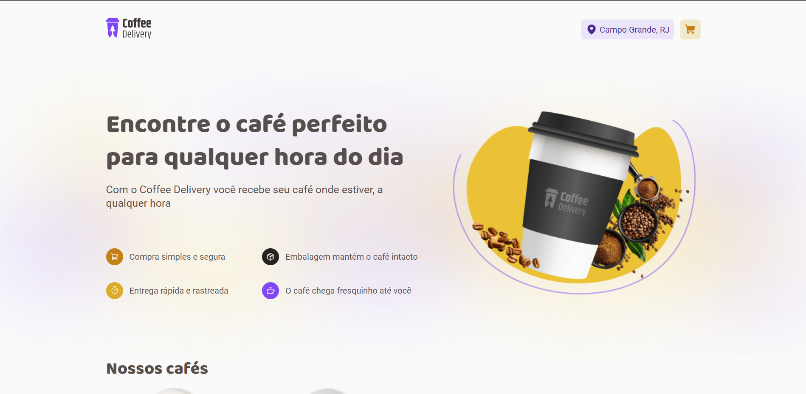
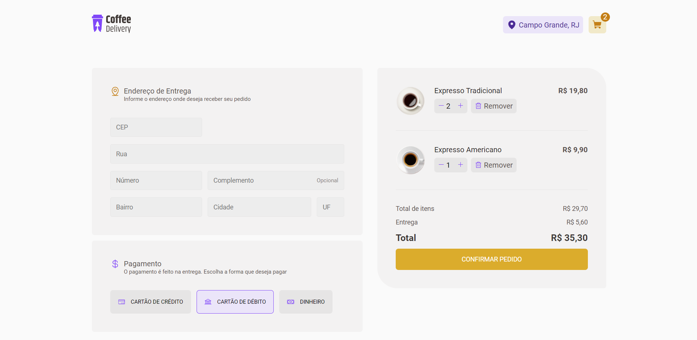

<h1 align="center">
    
</h1>

<p align="center">
  <a href="#about">Sobre</a> •
  <a href="#features">Features</a> •
  <a href="#how-it-works">Como funciona</a> • 
  <a href="#tech-stack">Stack</a> • 
</p>

<div align="center"> 
	
</div>

<div align="center"> 
	
</div>

## Sobre

☕ Coffe Delivery - é uma aplicação para gerenciar um carrinho de compras de uma cafeteria fictícia.

Projeto desenvolvimento durante o curso ReactJs Ignite da [Rocketseat](https://www.rocketseat.com.br/ignite).

---

## Features

- [x] Listagem de produtos (cafés) disponiveis para compra
- [x] Adicionar um produto ao carrinho
- [x] Informa localização atual do usuário pela latitude e longitude utilizando API Google Maps Platform
- [x] Dados persistidos no local storage dos produtos no carrinho
- [x] Fake API para trazer os produtos
---

## Como funciona

### Pré-requisitos

Antes de iniciar, você vai precisar ter as seguintes ferramentas instalada em sua maquina.
[Git] (https://git-scm.com), [Node.js] (https://nodejs.org/en/).

#### Executar a aplicação

```bash

# Clonar este repositorio
$ git clone https://github.com/nicholasmacedoo/coffee-delivery.git

# Acessar a pasta do projeto pelo terminal
$ cd coffee-delivery

# Instalar as dependências com npm
$ npm install

# Iniciar a fake api 
$ npm run api

# Executar a aplicação em modo de desenvolvimento
$ npm run dev

# Este app será aberto na porta: 3000 - acesse http://localhost:3000/

```
---
## Observação

Para conseguir exibir a informação atual do usuário é necessário chave da API Google Maps, basta gerar a chave, copiar e criar um arquivo .env no projeto segue o .env.example para te auxiliar.
```
# API KEY GOOGLE MAPS PLATFORM  
# IT'S NECESSARY TO WORKING AND DISPLAY THE LOCATION
VITE_KEY_GOOGLEMAPS=copie-sua-chave-aqui
```
---

## Tecnologias usadas

Na contrução do projeto foram utilizados as seguintes tecnologias:

#### **Website**  ([React](https://reactjs.org/)  +  [TypeScript](https://www.typescriptlang.org/))

- **[PhosphorIcons](https://phosphoricons.com/)**
- **[Vite](https://vitejs.dev/)**
- **[React Router](https://v5.reactrouter.com/web/guides/quick-start)**
- **[Styled Components](https://styled-components.com/)**
- **[React Toastify](https://fkhadra.github.io/react-toastify/introduction/)**
- **[Json Server](https://github.com/typicode/json-server)**
